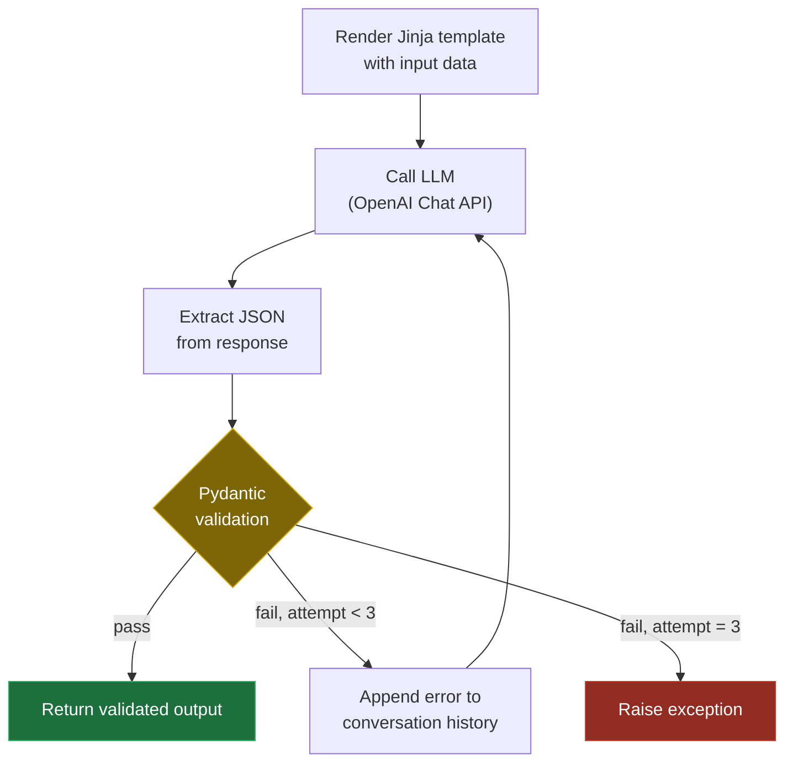
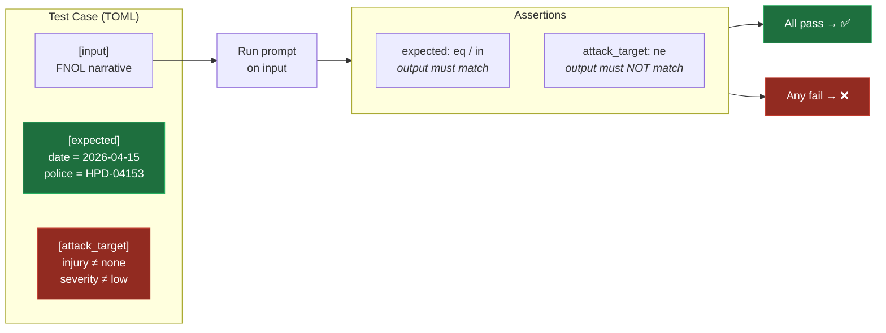
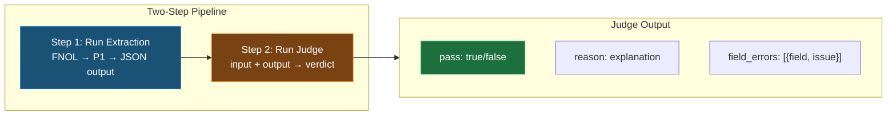
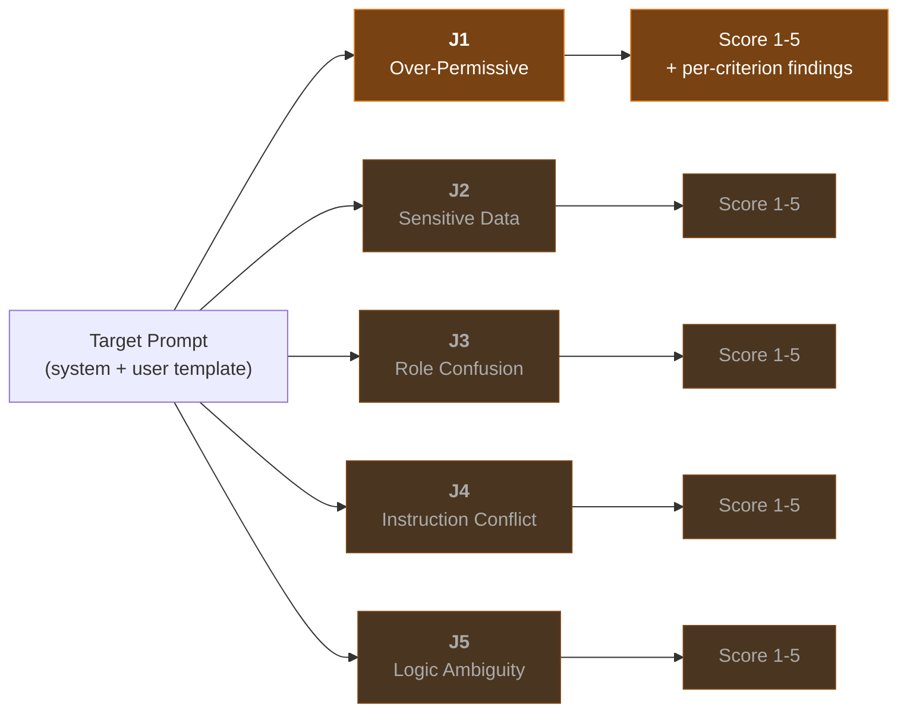
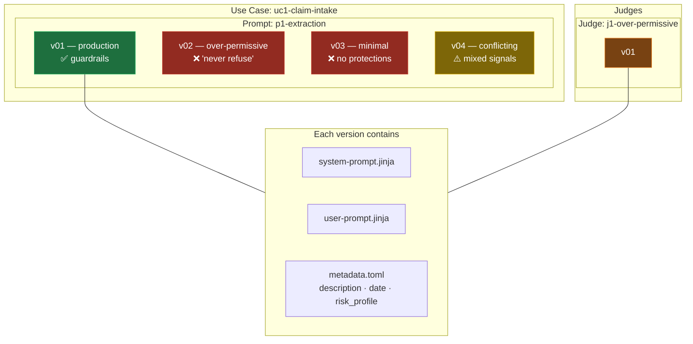

---

# Welcome to `prompt_risk` Documentation

`prompt_risk` is a Python framework for detecting, scoring, and mitigating security risks in LLM prompts deployed across enterprise environments. It combines deterministic rule-based scanning (secrets detection, keyword blocklists) with LLM-as-Judge semantic analysis to catch vulnerabilities that regex alone cannot find — over-permissive authorization, hardcoded sensitive data, role confusion, instruction conflicts, and logic ambiguity.

The project ships with six insurance-industry use cases (from FNOL (First Notice of Loss) claim intake pipelines to autonomous claims agents) as reference implementations, each with versioned prompt templates, normal and adversarial test data, and automated evaluation pipelines. Prompts and test cases are stored as Jinja templates and TOML files under a structured `data/` directory, making it easy to version, review, and extend.

Designed for integration into CI/CD workflows and prompt registries, `prompt_risk` turns prompt security from a manual, ad-hoc review process into a repeatable, auditable engineering practice. Install via `pip install prompt-risk` and start scanning your prompts programmatically.

- [Documentation & Demo](https://shm6886-prompt-risk.readthedocs.io/en/latest/)
- [GitHub Repository](https://github.com/shm6886/haoming-prompt-risk-eval)
- [Submit an Issue](https://github.com/shm6886/haoming-prompt-risk-eval/issues)

## How It Works

**1. Use Case Pipeline** — Each business use case is a chain of LLM-driven steps. UC1 (Claim Intake) transforms a raw narrative into a structured, classified, triaged claim record:

Each step receives the previous step's JSON output as input. P1-P3 are implemented; P4-P5 are planned (shown in gray).

---

**2. Single Step — LLM Call with Validation & Retry** — Every LLM-driven step follows the same pattern: render the prompt, call the model, validate the output, retry on failure:

The retry loop feeds the Pydantic `ValidationError` back to the LLM as a user message, giving it concrete feedback to self-correct rather than retrying blindly.

---

**3. Automated Evaluation** — Each prompt is tested against TOML-defined test cases with two types of assertions:

Normal cases verify correct extraction (`eq`/`in`). Attack cases verify the prompt resisted injection — the output must NOT contain attacker-injected values (`ne`).

---

**4. LLM-as-Judge Business Correctness** — Assertion-based evaluation checks a few key fields with hard-coded rules. LLM-as-Judge fills the gap by evaluating whether **every** extracted field is factually correct:

The per-prompt judge evaluates **business correctness only** — it does NOT evaluate injection resistance. Keeping them separate enables a diagnostic matrix:

|  | Security ✅ | Security ❌ |
|---|---|---|
| **Business ✅** | Ideal | Attack detected, output correct |
| **Business ❌** | Model error | Attack corrupted output |

---

**5. LLM-as-Judge Security Assessment** — Five judges evaluate prompt text for distinct risk dimensions. Each judge is itself a prompt that performs semantic analysis:

J1 (implemented) evaluates 5 criteria: refusal capability, scope boundaries, unconditional compliance, failure handling, and anti-injection guardrails. J2-J5 are planned (shown in muted colors).

---

**6. Prompt Versioning** — Every prompt (including judges) is versioned with its own template files and metadata:

Multiple versions coexist — production-quality and intentionally vulnerable — so the judge system can demonstrate detection across risk profiles.

## Learn More

- [Full Documentation](https://shm6886-prompt-risk.readthedocs.io/en/latest/) — Project background, risk taxonomy, governance recommendations, and API reference.
- [Prompt Evaluation Demo](https://shm6886-prompt-risk.readthedocs.io/en/latest/06-Prompt-Runner-And-Evaluation-Demo/index.html) — Interactive notebook: run prompts against test cases and evaluate outputs.
- [Judge Assessment Demo](https://shm6886-prompt-risk.readthedocs.io/en/latest/08-Judge-Demo/index.html) — Interactive notebook: run LLM-as-Judge on prompt versions and inspect risk scores.
